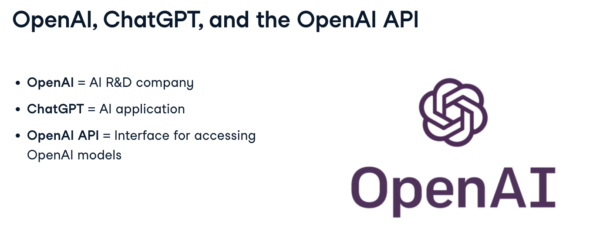
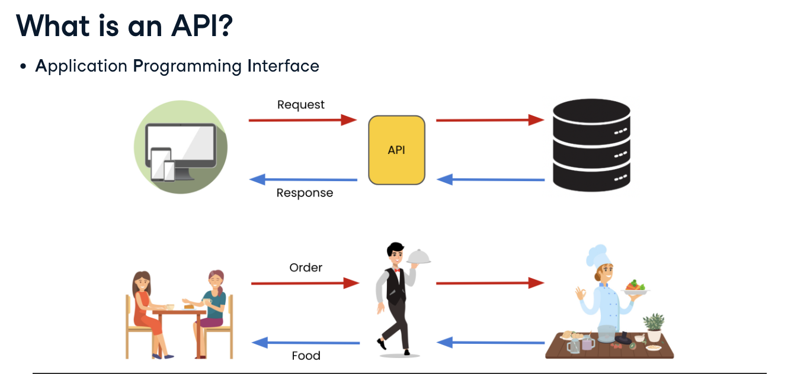
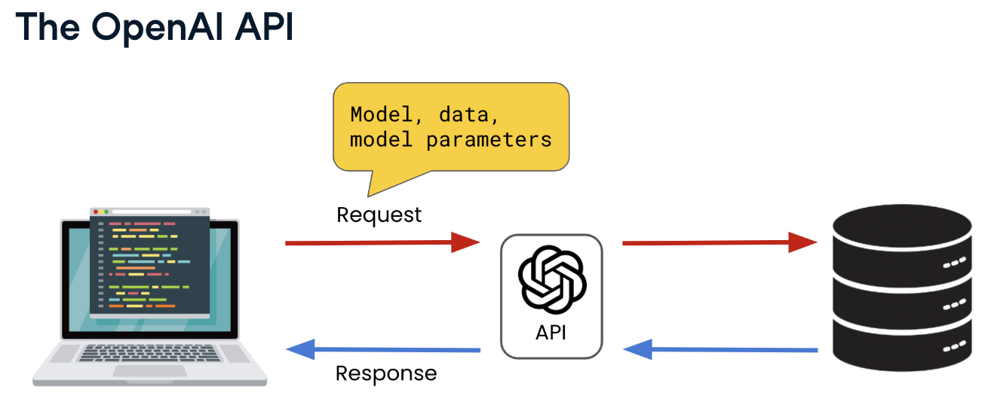
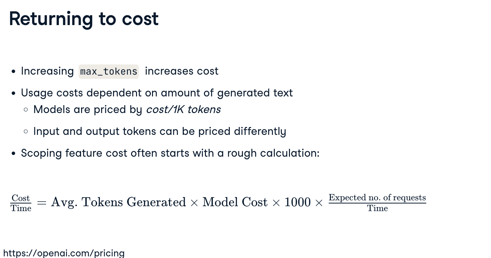
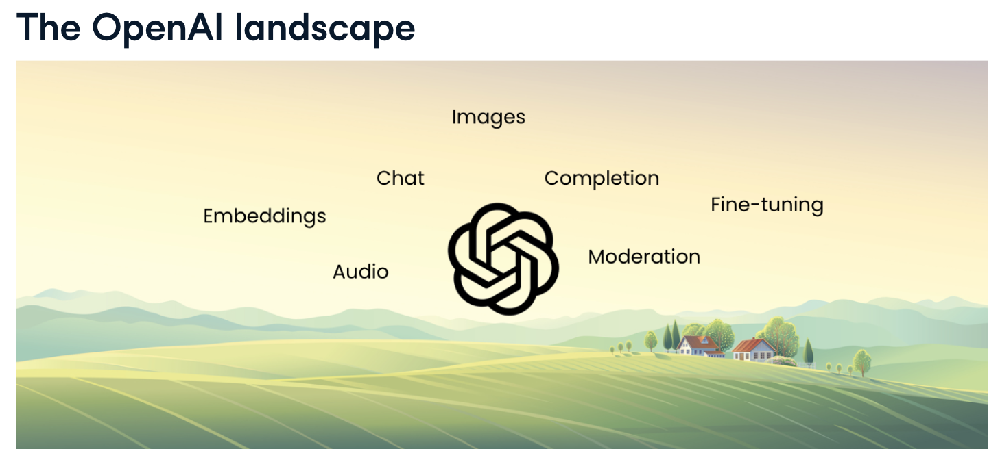
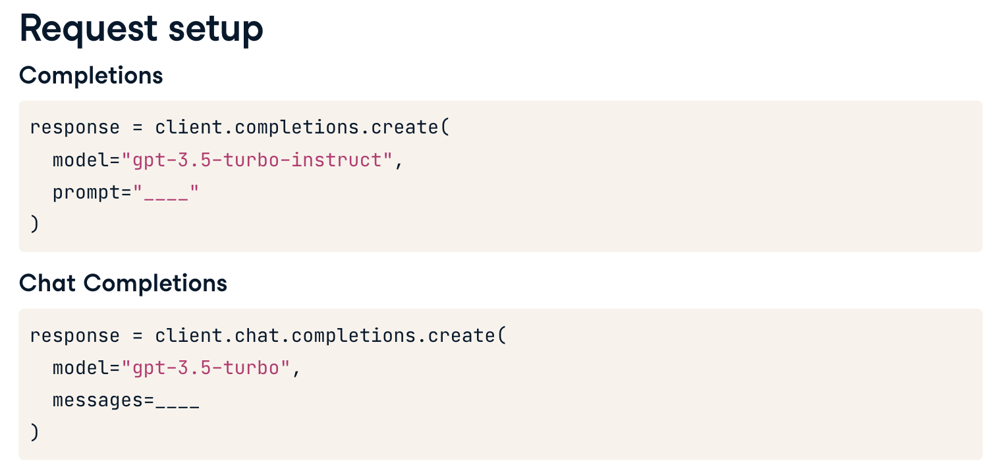
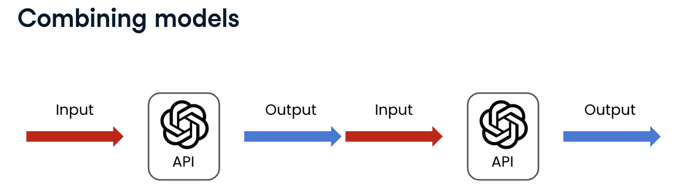
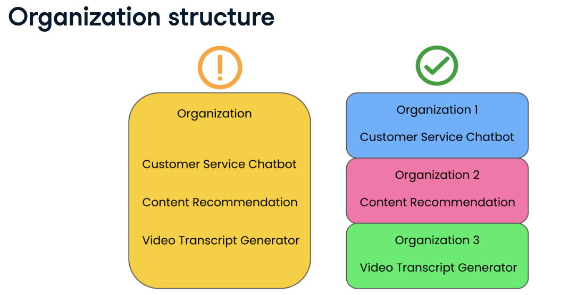
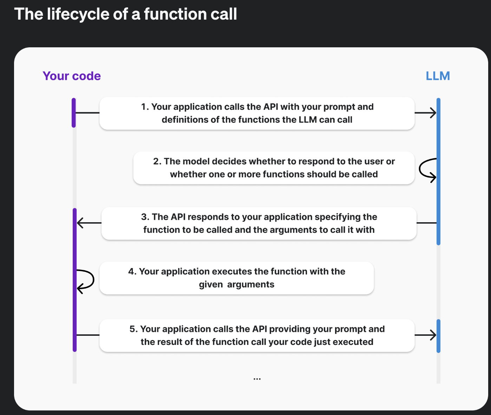
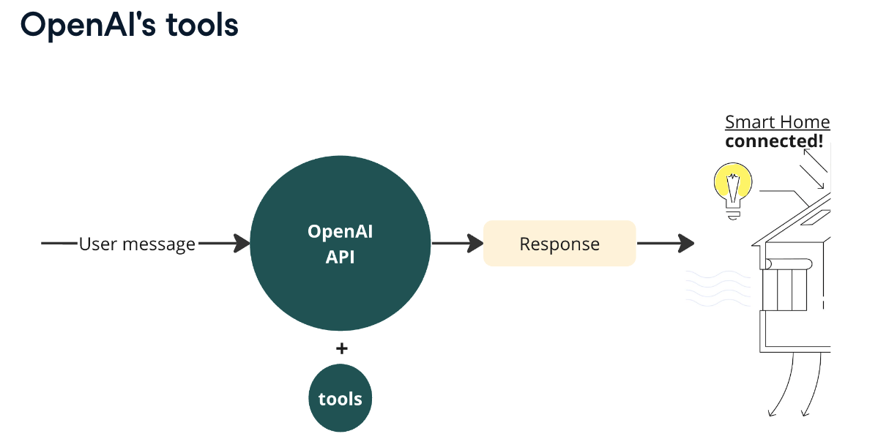

# Working with the OpenAI API 
1. Understand OpenAI API
2. Usage costs
3. Endpoints
4. parameters of the API requests
5. prompt engineering - to answer use cases
6. combining models - chaining
7. error handling (for production environment)
8. API rate
9. Function calling


#################################################################
## 1. Understand OpenAI API
https://platform.openai.com/signup 
https://platform.openai.com/account/api-keys 





API Application programming interface : act as messengers between software applications, taking a request to a system and receiving a response containing data or services



We can write code to interact with the OpenAI API and request the use of one of their models


Open AI has its own python library called openai, an abstraction to make requests to the API, importing the OpenAI Class from openai library which is used to instantiate a python API client. The client configures the environment for communicating with the API and make the request 

--> need Authentication key

#################################################################
## 2. Usage costs
depending on the model requested and on the size of the model input and output

Calculating cost per time

#################################################################
## 3. endpoints : 




### completions endpoint (single turn) : 
Usually using a *gpt35-turbo-instruct* to perform single turn
- used with a prompt (input text)
- generate text (output text) to complete the prompt in a likely and consistent way
- the response is a Completion object with various attributes
- tasks : answer questions, classification into categories, sentiment analysis, explaining complex topics

### chat endpoint (multiturn tasks)
usually using a *gpt35-turbo* to perform multi turn : cheaper that the turbo instruct. 
ideation, customer support assistant, personal tutor, translating languages, writing code... or perform single turn tasks. 
- existence of roles for better customization :system (behavior of the assistant), user (instruct the assistant), assistant (response to the user instruction). 
- The assistant role can also be written by the user to provide examples to help the model better understand.
- the prompt is now a list of messages, each message being a dictionary with a role
- storing responses to create a conversation history

### moderation endpoint
checks content for violations of the OPenai's usage policies, including : 
- incinting violence, 
- hate speech
- can customize model sensitivity to specific violations

The response consists in : 
- category violation : True/False
- category score : confidence of a violation. larger numbers --> greater certainty of violation. Numbers are between 0 and 1 but are not probabilities
- flagged True / False indicator of a violation

category scores : we have to determine appropriate thresholds for each use case. 
- stricter thresholds may result in *fewer false negative* (students communications in a school...). To flag more content even if that means accidentally flagging some non-violations. The goal is here to minimize the number of missed violations so called false negatives
- or more lenient thresholds may result in *fewer false positive* (communication, law enforcement) so reports on crimes are not accidentally flagged. Incorrectly flagging a crime report here would be an example of false positive. 

### audio endpoint : Speech to text transcription  with whisper
- model Whisper
- audio transcripts 
    - automating meeting transcripts
    - video caption generation (accessibility)
- translate audio from one language into an english transcript
- supports mp3, mp4, mpeg, mpga, m4a, wav, webm (25MB limit)
- other languages than english are supported

The audio file is read and then stored as binary format. 

### audio endpoint : Speech Translation with whisper
- Translate and transcribe audio
- limited to English transcripts? (german to english but not german to french ?)
- supports mp3, mp4, mpeg, mpga, m4a, wav, webm (25MB limit)
QUality varies on audio quality, audio language and model's knowledge. Beware before creating a whole application on that model and endpoint. --> to help the model do the best, we can provide a prompt to the model. Can improve the quality of the model by:
- providing an example of desired style
- provide context on transcript context


#################################################################
## 4. parameters of the API requests
- temperature : control on determinism, ranges from 0 (highly deterministic) to 2 (very random)
- max_tokens
- n number of responses
- model
- prompt
- topp
- frequence penalty
- tools = function_definition (see functions)

### response_format parameter for the API
- response format both in the prompt and as a parameter.
- what are the other formats? Json is very used and useful
Beware you have to add the response format inside of the prompt as "you answer in Json format" either you will have an error when get_response() is run. https://platform.openai.com/docs/guides/structured-outputs/examples 

https://openai.com/index/introducing-structured-outputs-in-the-api/ 
3 possibilities : 
1. no structure specified for the output
2. structured JSON
3. custom structure defined using a class ()

#################################################################
## 5. prompt engineering - to answer use cases

Providing a more specific prompt gave you much greater control over the model's response
- content generation : 
    - question answering
    - ideation """create a tagline for a new hotdog stand"""
    
- content transformation (changing based on an instruction)
    - Find and replace : temperature 0.5, max_tokens 100
    - summarization : temperature 0, max_tokens 400
    - copyediting
    Begin with the instruction and then the text to transform. 
    """Update name to Maarten, pronouns to he/him and job title to Senior Content Developer in:
    Joanne is an AI developer. She likes playing with her kids"""

- text classification : assigning a label to a piece of information
    - identifying the language from text
    - categorization (sorting places)
    - classifying sentiments
Completions endpoint can perform these tasks providing the model has sufficient knowledge and the prompt contains sufficient context.

*zero shot prompting* no example provided

*In context-learning*
*one shot prompting* one example provided
*few shot prompting* a handful of examples provided


#################################################################
## 6. combining models - chaining


*chaining* :feeding output from one model into another model.
- summarizing a meeting recording chaining whisper to gpt text model


#################################################################
## 7. error handling (for production environment)

AI systems are complex so 
- simplifying the user experience is crucial. 
- eliminating barriers to using these system
- display a user friendly error message 
- alternatives for when the service is unavailable

*Connection errors* : 
Generally due to connection issues on either the user's or the service's side. 
--> InternalServerError, APIConnectionError, APITimeoutError
--> solution : check our connection configuration (firewalls), wait and retry. Reach out the support if that fails. 

*Resource Limits Errors *
Generally due limits on the frequency of requests or the amount of text passed.
--> RateLimitError, ConflictError
--> solution : ensure that the requests are paced within the limits of the API : reducing the amount of text in the requests sent or staggering requests if they are frequent 

*Authentication Errors*
AuthenticationError code 401, Incorrect API key

*Bad request Errors*
The request  was malformed or missing some required parameters (invalid messages...) or model deprecated : NotFoundError code 404

==> try except blocks to encapsulate the API call !


#################################################################
## 8. API rate

API rate limits are another key consideration for companies building features on the OpenAI API. Rate limits are a cap on the frequency and size of API requests. They are put in place to ensure fair access to the API, prevent misuse, and also manage the infrastructure that supports the API. For many cases, this may not be an issue, but if a feature is exposed to a large user base, or the requests require generating large bodies of content, they could be at risk of hitting the rate limits. https://platform.openai.com/docs/guides/rate-limits

If you send many requests or use lots of tokens in a short period, you may hit your rate limit and see an ```openai.error.RateLimitError```. If you see this error, please wait a minute for your quota to reset and you should be able to begin sending more requests. Please see OpenAI's rate limit error support article for more information. https://help.openai.com/en/articles/6897202-ratelimiterror

What are the solutions to the rate limit errors ? Handling this error will help us maximize the requests to the API while minimizing delays and avoiding failed responses. Rate limits regulate the flow of data between users and the API. By avoiding single users from making excessive requests, rate limits can prevent malicious attacks, as well as ensuring a balanced distribution between users within an organization.

A *rate limit error* can be due to either 
- the number of requests in a given timespan being too high, meaning there are *too many requests* being sent, 
- or the number of tokens in the requests exceeding certain limits, meaning *too much text* has been included in the request.

Some solutions to avoid these limits include 
- *retry* : performing a *short pause between requests*, setting the function to retry in case limits are hit. 
- *batching* : processing multiple messages in one request. If the *frequency of requests* is hitting the rate limit, multiple requests can be sent in batches at more staggered time intervals: this is referred to as 'batching'. 
- *RReducing tokens* : quantifying and cutting down the number of tokens. If the tokens limit is hit, the number of tokens can be quantified and reduced accordingly.

### First solution to API rates : organizations

Much of this risk can be mitigated by, instead of running multiple features under the same organization.

For business use cases with frequent requests to the API, it's important to manage usage across the business. Setting up an organization for the API allows for better management of access, billing, and usage limits to the API. Users can be part of multiple organizations and attribute requests to specific organizations for billing. https://platform.openai.com/account/org-settings

To attribute a request to a specific organization, we only need to add one more line of code. Like the API key, the organization ID can be set before the request.

#### Organization structure

having separate organizations for each business unit or product feature, depending on the number of features built on the OpenAI API.



In this example, we've created separate OpenAI organizations for three different AI-powered features: a customer service chatbot, a content recommendation system, and a video transcript generator. This distributes the requests to reduce the risk of hitting the rate limit. It also removes the single failure point, so an issue to one organization, such as a billing issue, will only result in the failure of a single feature. Product-separated organizations also provides more granular insights into usage and billing.

you can set up organizations to manage API usage and billing. Users can be part of multiple organizations and attribute API requests to a specific organization. It's best practice to structure organizations such that each business unit or product feature has a separate organization, depending on the number of features the business has built on the OpenAI API.


### Second solution : retrying

When sending requests that might go above the rate limit due to their high frequency, we can set our function to automatically retry in case the limit is hit. One way to approach this is by adding a *retry decorator using Python's Tenacity library*. A decorator is a way to slightly modify the function without changing its inner code, and the retry decorator is used to control the extent to which the function should be run again when failing.

The wait parameter can be configured through the wait_random_exponential() function. Using the exponential backoff mode is a way to automatically retry requests with gradually increasing delays from a minimum, in this case of 1 second, to a maximum value, in this case of 60 seconds. The stop parameter can be specified using the stop_after_attempt() function and specifying the maximum number of tries. To use the decorator we'll have to wrap our response request as a function, such as in this example where we have a get_response() function returning the message.


### Third solution : batching
If the rate limit is due to the timing of the requests and not the number of tokens, one way to avoid it is to send the requests in batches. This is a much more efficient approach than looping through the Chat Completions endpoint, passing one question per iteration. See example

### Forth solution : reducing tokens

Another way to avoid rate limit errors if the time frequency of requests is not an issue, is to reduce tokens. 
Tokens can be thought of as chunks of words that constitute 'units' of a word. 

One way to measure tokens in Python is to use the tiktoken library: this way we can first create the encoding using the 'encoding_for_model' function and selecting the model we are using, and then count the tokens in the prompt, such as in the sentence we have in this example, using 'encode', and obtaining the total number using the 'len()' function. 
Each OpenAI model has different limits to the number of tokens that it can handle in input, and this also constitutes a way to check that the prompt is below those limits.

Notice that you can also limit the number of tokens of the output using max_tokens parameter in th OpenAI API request. 


#################################################################
## 9. Function calling

So far, the way we've generated structures outputs has been to have the API generate Json or custom output 
- by specifying the response_format parameter 
- and adding a system message to specify the format

But the reliability of our outputs are based on the model's interpretation which can be sometimes inconsistent.  Function calling addresses this issue by enabling OpenAI models to take user-defined functions as input, resulting in consistent responses without the need for complex text processing techniques. 

https://platform.openai.com/docs/guides/function-calling



In the API call for the *chat completions endpoint* add the parameter tools : ```tools = function_definition``` where the function_definition is a list of dictionaries

OpenAI endpoints support 'tools', that can be defined 
- to have the models return more specific information 
- or return more precise outputs by defining a certain structure. 
- Tools are options given to the endpoints that enhance the capabilities of the API call.

Example we wanted to use the OpenAI API to control a smart home device, such as a smart light bulb. 
- We could create a function that takes a natural language command, 
- sends it to the OpenAI API for processing, 
- and then interprets the response to control the hardware accordingly.



The response should be interpreted consistently across different users, so we'd have to make a change to the original API call. This is where tools come in: by defining certain rules, we set the model output to follow a precise structure. To specify this type of behavior we'd have to define our tool as a function that outputs the expected response, hence the name 'function calling'.

At a high level you can break down working with functions into three steps:
1. Call the chat completions API with your functions and the user’s input
2. Use the model’s response to call your API or function
3. Call the chat completions API again, including the response from your function to get a final response

### single function : going from unstructured to consistent structured output : 

By ensuring a reliable structure of our API response, we can integrate our AI application with external systems and be more certain of its reliability. For instance, we can extract instructions from a natural language input and pass them to a smart home system. --> may be replaced by new structured outputs functionality (08/2024)

The response from our API request that uses function calling will be nested in ```tool_calls[0].function.arguments```. ```tool_calls``` is a list, as there is an option to call multiple functions, and in that case each item in 'tool_calls' will contain the response from each function. In the example we have the job and location extracted from the job advert as output.

### calling multiple functions to answer complex questions

 called parallel function calling. For example, in an e-commerce customer service chatbot where the prompt given as input could trigger different functions, such as a function that retrieves the product catalog, one that reads from the website's FAQs, or another that provides a response.

*Parallel function calls* allow you to perform multiple function calls together, allowing for parallel execution and retrieval of results. This reduces the number of calls to the API that need to be made and can improve overall performance.

For example in our simple time app we retrieved multiple times at the same time. This resulted in a chat completion message with three function calls in the tool_calls array, each with a unique id. If you wanted to respond to these function calls, you would add three new messages to the conversation, each containing the result of one function call, with a tool_call_id referencing the id from tools_calls.


### calling external API: 
we can use function calling to define functions that enhance the responses by calling external APIs, such as for a weather chatbot calling an API to return current temperatures at specific locations.


### Prompt engineering with functions
When you define a function as part of your request, the details are injected into the system message using specific syntax that the model has been trained on. This means that functions consume tokens in your prompt and that you can apply prompt engineering techniques to optimize the performance of your function calls. The model uses the full context of the prompt to determine if a function should be called including function definition, the system message, and the user messages.

#### Improving quality and reliability
If the model isn't calling your function when or how you expect, there are a few things you can try to improve the quality.

1. Provide more details in your function definition
It's important that you provide a meaningful description of the function and provide descriptions for any parameter that might not be obvious to the model. For example, in the description for the location parameter, you could include extra details and examples on the format of the location.

"location": {
    "type": "string",
    "description": "The location of the hotel. The location should include the city and the state's abbreviation (i.e. Seattle, WA or Miami, FL)"
}

2. Provide more context in the system message
The system message can also be used to provide more context to the model. For example, if you have a function called search_hotels you could include a system message like the following to instruct the model to call the function when a user asks for help with finding a hotel.

{"role": "system", "content": "You're an AI assistant designed to help users search for hotels. When a user asks for help finding a hotel, you should call the search_hotels function."}

3. Instruct the model to ask clarifying questions
In some cases, you want to instruct the model to ask clarifying questions to prevent making assumptions about what values to use with functions. For example, with search_hotels you would want the model to ask for clarification if the user request didn't include details on location. To instruct the model to ask a clarifying question, you could include content like the next example in your system message.


{"role": "system", "content": "Don't make assumptions about what values to use with functions. Ask for clarification if a user request is ambiguous."}

#### Reducing errors

Another area where prompt engineering can be valuable is in reducing errors in function calls. The models are trained to generate function calls matching the schema that you define, but the models produce a function call that doesn't match the schema you defined or try to call a function that you didn't include.

If you find the model is generating function calls that weren't provided, try including a sentence in the system message that says "Only use the functions you have been provided with.".


#################################################################
## 10. moderation and safety
- control unwanted inputs
- minimizing the risk of data leaks

#################################################################
## 11. testing and validation
- checking for responses that are out of topic
- testing for inconsistent behavior

#################################################################
## 12. communication with external systems
- calling external functions and APIs
- Optimizing response times


#################################################################
## Annexes
converting the response into a dictionary
print(response.model_dump())

#################################################################
## sources
- OpenAI platform documentation
- Azure OpenAI documentation
- Datacamp
